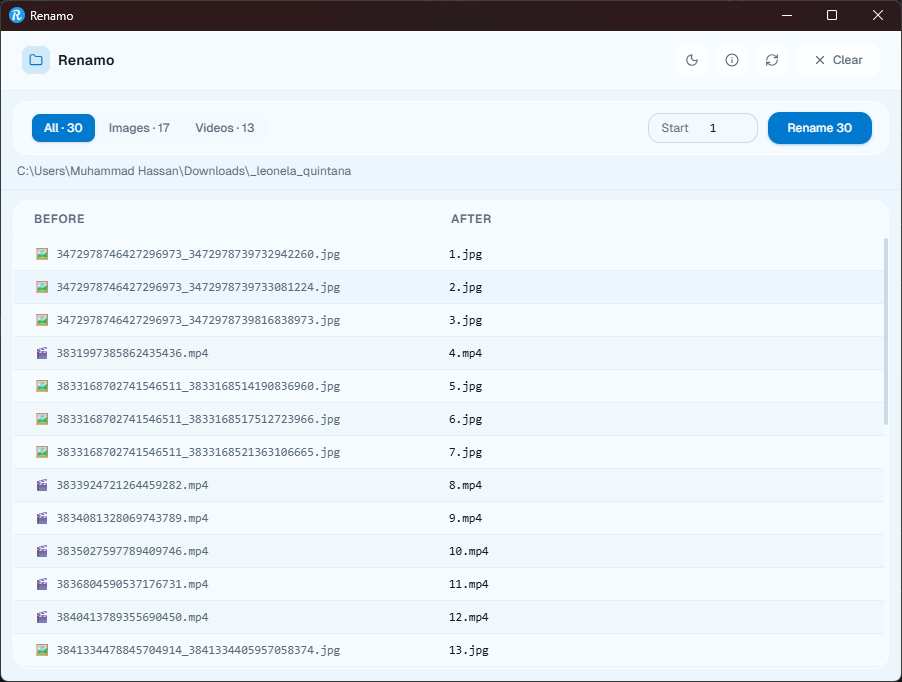

<div align="center">

# 🗂️ Renamo

### Sequential file renamer for images and videos
**Fast · Clean · Reversible**

[](https://github.com/miangee21/Renamo/releases/latest)
[](https://github.com/miangee21/Renamo/releases)
[](LICENSE)
[](https://github.com/miangee21/Renamo/releases/latest)



</div>

---

## ✨ Features

- 📁 **Folder select** — Pick any folder, files load instantly
- 👁️ **Live preview** — See Before → After names before committing
- 🔢 **Custom start number** — Start from 1, 445, or any number
- 🖼️ **Smart filters** — View All, Images only, or Videos only
- ↩️ **Undo** — Instantly restore original names after rename
- ⚡ **Fast** — PowerShell-powered, handles 10,000+ files
- 🌙 **Dark / Light mode** — Persists across sessions
- ⌨️ **Keyboard shortcuts** — Blazing fast workflow
- 🔄 **Auto-updater** — Check for updates with one click
- 🪟 **Windows native** — Built with Tauri, ~5MB install size

---

## 📥 Installation

### Option 1 — Download Installer (Recommended)

Go to [Releases](https://github.com/miangee21/Renamo/releases/latest) and download:

- `Renamo_x.x.x_x64-setup.exe` — NSIS Installer
- `Renamo_x.x.x_x64_en-US.msi` — MSI Installer

### Option 2 — winget

```bash
winget install Renamo
```

> Note: winget availability depends on Windows Package Manager submission. Check [releases](https://github.com/miangee21/Renamo/releases) for the latest installer.

---

## 🚀 Usage

1. **Open the app**
2. Click **Select Folder** or press `O`
3. Choose your filter — All / Images / Videos
4. Set **Start number** (default: 1)
5. Review the **Before → After** preview
6. Click **Rename** or press `R`
7. Made a mistake? Press **Undo** or `Ctrl+Z`

---

## ⌨️ Keyboard Shortcuts

| Key | Action |
|-----|--------|
| `O` | Open folder |
| `R` | Rename files |
| `F` | Refresh folder |
| `C` | Clear / reset |
| `Ctrl+Z` | Undo last rename |
| `Esc` | Close dialog |
| `Enter` / `→` | Confirm dialog |
| `←` | Cancel dialog |

---

## 🖼️ Supported Formats

**Images:** `jpg` `jpeg` `png` `gif` `bmp` `webp` `tiff` `heic` `avif` `raw` `cr2` `nef` `arw` `svg`

**Videos:** `mp4` `mkv` `avi` `mov` `wmv` `flv` `webm` `m4v` `3gp` `ts` `mts` `vob`

---

## 🔢 How Renaming Works

Files are sorted in **natural order** (same as Windows Explorer), then renamed sequentially:

```
Before                        After
─────────────────────────     ─────────
IMG_20230101.jpg          →   1.jpg
DSC_9821.jpg              →   2.jpg
video_final.mp4           →   3.mp4
Screenshot_2024.png       →   4.png
```

With custom start number (e.g. 445):
```
Before                        After
─────────────────────────     ─────────
IMG_20230101.jpg          →   445.jpg
DSC_9821.jpg              →   446.jpg
video_final.mp4           →   447.mp4
```

**Extensions are never changed** — only the filename.

---

## 🛠️ Build from Source

### Prerequisites

- [Node.js](https://nodejs.org/) v20+
- [Rust](https://rustup.rs/) (stable)
- [Microsoft C++ Build Tools](https://visualstudio.microsoft.com/visual-cpp-build-tools/)
- WebView2 (included in Windows 11, [download for Windows 10](https://developer.microsoft.com/en-us/microsoft-edge/webview2/))

### Setup

```bash
# Clone the repo
git clone https://github.com/miangee21/Renamo.git
cd renamo

# Install dependencies
npm install

# Run in development
npm run tauri dev

# Build for production
npm run tauri build
```

Build output:
```
src-tauri/target/release/bundle/
├── msi/Renamo_x.x.x_x64_en-US.msi
└── nsis/Renamo_x.x.x_x64-setup.exe
```

---

## 🧰 Tech Stack

| Technology | Role |
|---|---|
| [Tauri 2](https://tauri.app/) | Desktop wrapper (Rust) |
| [React 18](https://react.dev/) | UI framework |
| [TypeScript](https://www.typescriptlang.org/) | Type safety |
| [Tailwind CSS v4](https://tailwindcss.com/) | Styling |
| [shadcn/ui](https://ui.shadcn.com/) | UI components |
| [PowerShell](https://learn.microsoft.com/en-us/powershell/) | File rename engine (Windows) |

---

## 🐧 Linux / macOS

Renamo is currently built for **Windows**. The codebase is structured for cross-platform support — on non-Windows systems, Rust's native `std::fs::rename` is used instead of PowerShell.

Linux/macOS builds are planned for a future release.

---

## 🤝 Contributing

Contributions are welcome! Feel free to:

- 🐛 [Report bugs](https://github.com/miangee21/Renamo/issues)
- 💡 [Request features](https://github.com/miangee21/Renamo/issues)
- 🔧 Submit pull requests

---

## 📬 Contact

**Mian Gee**
- GitHub: [@miangee21](https://github.com/miangee21)
- Discord: `miangee`

---

## 📄 License

[MIT](LICENSE) — free to use, modify, and distribute.

---

<p align="center">Made with ❤️ by <a href="https://github.com/miangee21">Mian Gee</a></p>